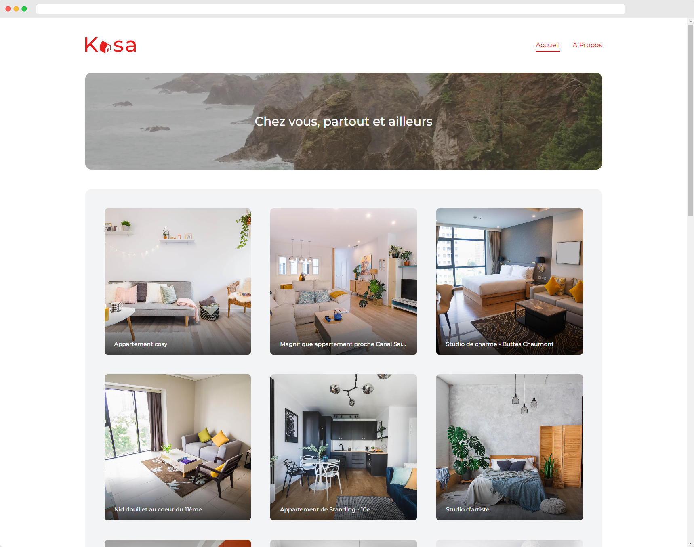

# Kasa (Original version)



## Overview

For this project I had to create a website for a real estate agency. The agency is called Kasa and it is a fictitious agency.

> This version is the original version of the project. I have made a second version of the project, which is more advanced. You can find it [here](https://github.com/alexperronnet/openclassrooms-p11-kasa)

## Stack

For this project I used the following technologies:

- [Saas](https://sass-lang.com/) for the stylesheets
- [ReactJS](https://reactjs.org/)
- [ViteJS](https://vitejs.dev/)
- [React Router](https://reactrouter.com/) for the routing
- [Prettier](https://prettier.io/) for code formatting

## Local Setup

### Clone the repository

```bash
git clone https://github.com/alexperronnet/openclassrooms-p11-kasa.git
```

### Navigate to the project folder

```bash
cd openclassrooms-p7-les-petits-plats
```

### Switch to the original version branch

```bash
git checkout main-v1
```

### Install dependencies

```bash
pnpm install (or npm install or yarn install)
```

### Run the application

```bash
pnpm run dev (or npm run dev or yarn dev)
```

## Deployment

The application is deployed on [Netlify](https://www.netlify.com/).

## License

This is an OpenClassrooms project. The code is freely reusable, but assets (images, videos and logo) are not because they are not mine.

If you are also a student of OC, you can freely use my work as inspiration, but I advise you not to copy parts of it.
